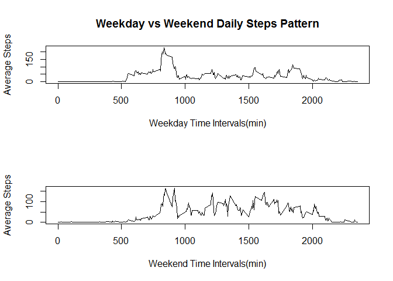

# Reproducible Research: Peer Assessment 1

## Loading and preprocessing the data


```r
library(knitr)
library(plyr)
steps_data = read.csv(unz("activity.zip", "activity.csv"),header=T)
```

### Here are the top rows of the raw data

```r
head(steps_data)
```

```
##   steps       date interval
## 1    NA 2012-10-01        0
## 2    NA 2012-10-01        5
## 3    NA 2012-10-01       10
## 4    NA 2012-10-01       15
## 5    NA 2012-10-01       20
## 6    NA 2012-10-01       25
```


## What is mean total number of steps taken per day?


```r
steps_data_filter = steps_data[complete.cases(steps_data),]
steps_day_data = ddply(steps_data_filter,"date",summarise,DailySteps = sum(as.integer(steps)))
```


### Here are the top rows of the Daily Steps data

```r
head(steps_day_data)
```

```
##         date DailySteps
## 1 2012-10-02        126
## 2 2012-10-03      11352
## 3 2012-10-04      12116
## 4 2012-10-05      13294
## 5 2012-10-06      15420
## 6 2012-10-07      11015
```


### histogram of total number of steps taken each day

```r
par(mfrow = c(1,1))
hist(steps_day_data$DailySteps)
```

 


### mean and median of total steps taken per day

```r
mean_steps_per_day = mean(steps_day_data$DailySteps)
median_steps_per_day = median(steps_day_data$DailySteps)
```

Mean of total steps taken per day = 1.0766189\times 10^{4}


Median of total steps taken per day = 10765


## What is the average daily activity pattern?


```r
steps_per_interval = ddply(steps_data_filter,"interval",summarise,IntervalSteps = mean(as.integer(steps)))
par(mfrow = c(1,1))
with(steps_per_interval,plot(interval,IntervalSteps,xlab="Time Intervals (mins)",ylab="Average Steps",type="l"))
title(main = "Daily Activity Pattern")
```

 


```r
max_avg_steps = max(steps_per_interval$IntervalSteps)
time_duration = steps_per_interval[steps_per_interval$IntervalSteps == max_avg_steps,1]
max_avg_steps_round = round(max_avg_steps,digits = 2)
```

Time interval 835 contains maximum number of steps which are on Average 206.17

## Imputing missing values

### Calculating Total missing values


```r
missing_values = nrow(steps_data) - sum(complete.cases(steps_data))
```

Total missing values in the data set are 2304

### Replacing missing Values with mean of 5 mintue intervals on other days


```r
replace_na <- function(x) replace(x, is.na(x), round(mean(x, na.rm = TRUE),0))
new_steps_data <- ddply(steps_data, ~ interval, transform, steps = replace_na(steps))

new_steps_day_data = ddply(new_steps_data,"date",summarise,DailySteps = sum(as.integer(steps)))
```


### Here are the top rows of the new data with no NAs

```r
head(new_steps_day_data)
```

```
##         date DailySteps
## 1 2012-10-01      10762
## 2 2012-10-02        126
## 3 2012-10-03      11352
## 4 2012-10-04      12116
## 5 2012-10-05      13294
## 6 2012-10-06      15420
```


### histogram of total number of steps taken each day (no NAs)

```r
par(mfrow = c(1,1))
hist(new_steps_day_data$DailySteps)
```

 


### mean and median of total steps taken per day (no NAs)

```r
new_mean_steps_per_day = mean(new_steps_day_data$DailySteps)
new_median_steps_per_day = median(new_steps_day_data$DailySteps)
diff_mean = new_mean_steps_per_day - mean_steps_per_day
diff_median = new_median_steps_per_day - median_steps_per_day
```

New Mean of total steps taken per day = 1.0765639\times 10^{4} 


New Median of total steps taken per day = 10762


Diff between New and Old mean = -0.549335 


Diff between New and Old median = -3


## Are there differences in activity patterns between weekdays and weekends?


### Calculating Weekday and weekend Patterns in Daily Steps

```r
new_steps_data$DayofWeek = weekdays(as.Date(new_steps_data$date))
new_steps_data$Day = ifelse((new_steps_data$DayofWeek == "Saturday"|new_steps_data$DayofWeek == "Sunday"),"Weekend","WeekDay")
new_steps_data_Weekday = new_steps_data[new_steps_data$Day == "WeekDay",]
new_steps_data_Weekend = new_steps_data[new_steps_data$Day == "Weekend",]
new_steps_per_interval_weekday = ddply(new_steps_data_Weekday,"interval",summarise,IntervalSteps = mean(as.integer(steps)))
new_steps_per_interval_weekend = ddply(new_steps_data_Weekend,"interval",summarise,IntervalSteps = mean(as.integer(steps)))
```

### Plotting the Weekday Weekend pattern

```r
par(mfrow = c(2,1))
with(new_steps_per_interval_weekday,plot(interval,IntervalSteps,xlab="Weekday Time Intervals(min)",ylab="Average Steps",type="l"))
title(main = "Weekday vs Weekend Daily Steps Pattern")
with(new_steps_per_interval_weekend,plot(interval,IntervalSteps,xlab="Weekend Time Intervals(min)",ylab="Average Steps",type="l"))
```

 


